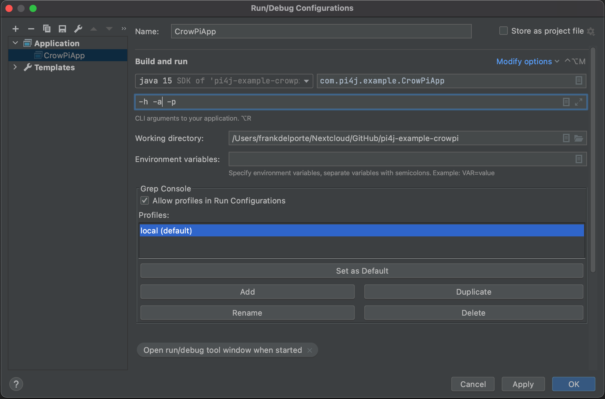

 Pi4J V2 :: Java I/O Library for Raspberry Pi :: CrowPi example application
===========================================================================

[](https://github.com/Pi4J/pi4j-example-crowpi/actions/workflows/maven.yml)

This project contains an example application which uses the Pi4J (V2) library and runs on the CrowPi to get introduced
into electronics programming. Full description is available on 
[the Pi4J website](https://v2.pi4j.com/getting-started/introduction-to-electronics-with-crowpi/).

## PROJECT OVERVIEW

The goal of the example project is to show how to set up a Pi4J project on the Raspberry Pi and control different
kinds of electronic components.

## RUNTIME DEPENDENCIES

This project uses Pi4J V.2 which has the following runtime dependency requirements:
- [**SLF4J (API)**](https://www.slf4j.org/)
- [**SLF4J-SIMPLE**](https://www.slf4j.org/)
- [**PIGPIO Library**](http://abyz.me.uk/rpi/pigpio) (for the Raspberry Pi) - This 
dependency comes pre-installed on recent Raspbian images.  However, you can also 
download and install it yourself using the instructions found 
[here](http://abyz.me.uk/rpi/pigpio/download.html).
  
## DEVELOPMENT

This project uses [the JCommander library](https://jcommander.org/) to easily start the application with a specific
demo. For example "-sl" to toggle all the state leds. During development these arguments can be configured e.g. in 
IntelliJ like this:



For Visual Studio Code the launch.json file is used to configure additional arguments. Change to the Run window to 
select which launch file you want to use to run the application.

TODO find solution how to run as sudo as PiGpio requires this....


## BUILD DEPENDENCIES & INSTRUCTIONS

This project can be built with [Apache Maven](https://maven.apache.org/) 3.6 
(or later) and Java 11 OpenJDK (or later). These prerequisites must be installed 
prior to building this project.  The following command can be used to download 
all project dependencies and compile the Java module.  You can build this 
project directly on a Raspberry Pi with Java 11+.  

```
mvn clean package
```

### Compiled application to run on the Raspberry Pi

Once the build is complete and was successful, you can find the compiled artifacts in the `target` directory. 
Specifically all dependency modules (JARs) and a simple `run.sh` bash script will be located in the
`target/distribution` directory.  

These are all the required files needed to distribute (copy) to your
Raspberry Pi to run this project.  If you are using the native bindings running 
locally on the Raspberry Pi, then you make have to run the program using `sudo` 
to gain the necessary access permissions to the hardware I/O. 

This is the list of files created by the build process of this example application:

* pi4j-core
* pi4j-example-crowpi
* pi4j-library-pigpio
* pi4j-plugin-pigpio
* pi4j-plugin-raspberrypi
* slf4j-api
* slf4j-simple
* run.sh --> this is the actual start file which will run the application

Make the run script executable and start it like this:

```
chmod +x run.sh
sudo ./run.sh
```

## LICENSE

 Pi4J Version 2.0 and later is licensed under the Apache License,
 Version 2.0 (the "License"); you may not use this file except in
 compliance with the License.  You may obtain a copy of the License at:
      http://www.apache.org/licenses/LICENSE-2.0

 Unless required by applicable law or agreed to in writing, software
 distributed under the License is distributed on an "AS IS" BASIS,
 WITHOUT WARRANTIES OR CONDITIONS OF ANY KIND, either express or implied.
 See the License for the specific language governing permissions and
 limitations under the License.

